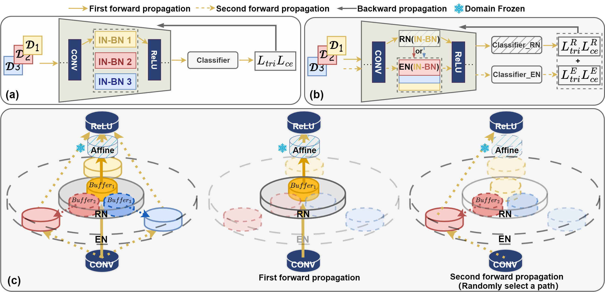

# Rethinking Normalization Layers for Domain Generalizable Person Re-identification


### Installation
* Please check [fast-reid](https://github.com/JDAI-CV/fast-reid/blob/master/INSTALL.md) for fast-reid installation
* Compile with cython to accelerate evalution: 
```
bash cd fastreid/evaluation/rank_cylib; make all
```
* The model is trained and evaluated on Market-1501, MSMT17, cuhkSYSU, CUHK03-NP. Download for these datasets, please refer to [fast-reid](https://github.com/JDAI-CV/fast-reid).

## Run

```
  # train
  python tools/train_net.py

  # test
  python3 tools/train_net.py --eval-only MODEL.WEIGHTS /path/to/checkpoint_file
```
## Acknowledgments
The code was developed based on [fast-reid] toolbox (https://github.com/JDAI-CV/fast-reid)